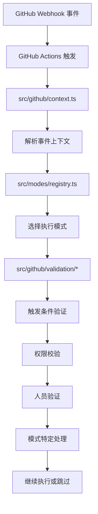
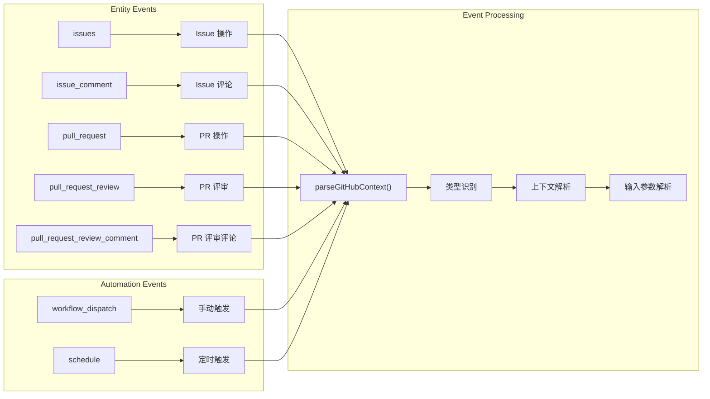
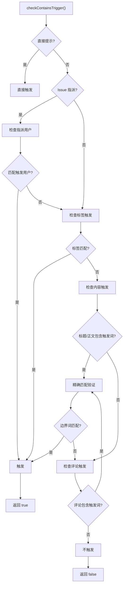
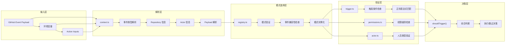
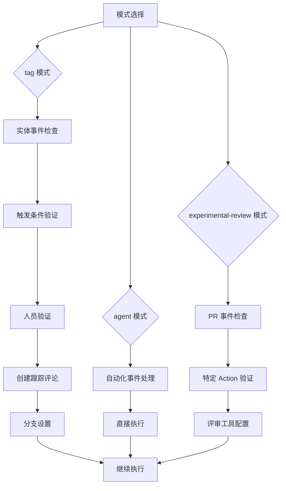
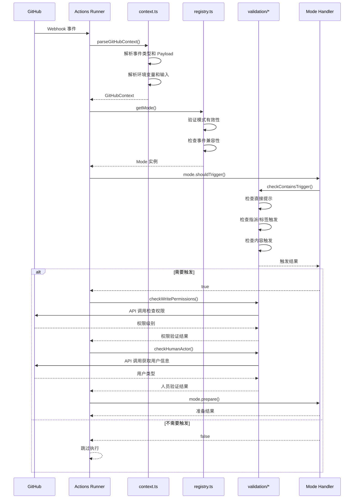

# 事件处理阶段详解

事件处理阶段是整个 Claude Code Action 的"感知层"，负责解析 GitHub 事件、验证触发条件、校验权限，并选择合适的执行模式。本文档详细说明其工作原理、代码结构和数据流。

## 整体架构图



## 事件类型分类图



## 触发条件验证流程



## 详细数据流图



## 核心模块详解

### 1. 事件解析：`src/github/context.ts`

```typescript
// 核心函数：parseGitHubContext()
export function parseGitHubContext(): GitHubContext {
  const context = github.context;
  
  // 1. 解析通用字段
  const commonFields = {
    runId: process.env.GITHUB_RUN_ID!,
    eventAction: context.payload.action,
    repository: {
      owner: context.repo.owner,
      repo: context.repo.repo,
      full_name: `${context.repo.owner}/${context.repo.repo}`,
    },
    actor: context.actor,
    inputs: {
      mode: modeInput as ModeName,
      triggerPhrase: process.env.TRIGGER_PHRASE ?? "@claude",
      assigneeTrigger: process.env.ASSIGNEE_TRIGGER ?? "",
      labelTrigger: process.env.LABEL_TRIGGER ?? "",
      allowedTools: parseMultilineInput(process.env.ALLOWED_TOOLS ?? ""),
      disallowedTools: parseMultilineInput(process.env.DISALLOWED_TOOLS ?? ""),
      customInstructions: process.env.CUSTOM_INSTRUCTIONS ?? "",
      directPrompt: process.env.DIRECT_PROMPT ?? "",
      // ... 更多配置
    },
  };
  
  // 2. 根据事件类型解析特定字段
  switch (context.eventName) {
    case "issues":
      return {
        ...commonFields,
        eventName: "issues",
        payload: context.payload as IssuesEvent,
        entityNumber: payload.issue.number,
        isPR: false,
      };
    case "issue_comment":
      return {
        ...commonFields,
        eventName: "issue_comment", 
        payload: context.payload as IssueCommentEvent,
        entityNumber: payload.issue.number,
        isPR: Boolean(payload.issue.pull_request),
      };
    // ... 其他事件类型
  }
}
```

**支持的事件类型：**
```typescript
// Entity Events (实体事件)
- issues: Issue 的创建、编辑、指派、标签等
- issue_comment: Issue 或 PR 的评论
- pull_request: PR 的创建、更新、关闭等
- pull_request_review: PR 的评审
- pull_request_review_comment: PR 评审中的评论

// Automation Events (自动化事件)  
- workflow_dispatch: 手动触发工作流
- schedule: 定时触发工作流
```

### 2. 触发验证：`src/github/validation/trigger.ts`

```typescript
// 核心函数：checkContainsTrigger()
export function checkContainsTrigger(context: ParsedGitHubContext): boolean {
  const { inputs: { assigneeTrigger, labelTrigger, triggerPhrase, directPrompt } } = context;
  
  // 1. 直接提示优先级最高
  if (directPrompt) {
    console.log(`Direct prompt provided, triggering action`);
    return true;
  }
  
  // 2. 检查 Issue 指派触发
  if (isIssuesAssignedEvent(context)) {
    let triggerUser = assigneeTrigger.replace(/^@/, "");
    const assigneeUsername = context.payload.assignee?.login || "";
    
    if (triggerUser && assigneeUsername === triggerUser) {
      console.log(`Issue assigned to trigger user '${triggerUser}'`);
      return true;
    }
  }
  
  // 3. 检查标签触发
  if (isIssuesEvent(context) && context.eventAction === "labeled") {
    const labelName = context.payload.label?.name || "";
    
    if (labelTrigger && labelName === labelTrigger) {
      console.log(`Issue labeled with trigger label '${labelTrigger}'`);
      return true;
    }
  }
  
  // 4. 检查内容触发（Issue/PR 标题和正文）
  if (isIssuesEvent(context) && context.eventAction === "opened") {
    const issueBody = context.payload.issue.body || "";
    const issueTitle = context.payload.issue.title || "";
    const regex = new RegExp(`(^|\\s)${escapeRegExp(triggerPhrase)}([\\s.,!?;:]|$)`);
    
    if (regex.test(issueBody) || regex.test(issueTitle)) {
      return true;
    }
  }
  
  // 5. 检查评论触发
  if (isIssueCommentEvent(context) || isPullRequestReviewCommentEvent(context)) {
    const commentBody = context.payload.comment.body;
    const regex = new RegExp(`(^|\\s)${escapeRegExp(triggerPhrase)}([\\s.,!?;:]|$)`);
    
    if (regex.test(commentBody)) {
      console.log(`Comment contains exact trigger phrase '${triggerPhrase}'`);
      return true;
    }
  }
  
  return false;
}
```

**触发词匹配策略：**
```typescript
// 精确匹配正则表达式
const regex = new RegExp(`(^|\\s)${escapeRegExp(triggerPhrase)}([\\s.,!?;:]|$)`);

// 示例匹配：
✅ "@claude please help"     // 词边界匹配
✅ "Hello @claude!"          // 标点符号边界
✅ "@claude"                 // 行首/行尾
❌ "email@claude.ai"         // 避免误匹配
❌ "@claude123"              // 避免部分匹配
```

### 3. 权限验证：`src/github/validation/permissions.ts`

```typescript
// 核心函数：checkWritePermissions()
export async function checkWritePermissions(
  octokit: Octokit,
  context: ParsedGitHubContext,
): Promise<boolean> {
  const { repository, actor } = context;
  
  try {
    // 检查协作者权限级别
    const response = await octokit.repos.getCollaboratorPermissionLevel({
      owner: repository.owner,
      repo: repository.repo,
      username: actor,
    });
    
    const permissionLevel = response.data.permission;
    core.info(`Permission level retrieved: ${permissionLevel}`);
    
    // 只允许 admin 和 write 权限
    if (permissionLevel === "admin" || permissionLevel === "write") {
      core.info(`Actor has write access: ${permissionLevel}`);
      return true;
    } else {
      core.warning(`Actor has insufficient permissions: ${permissionLevel}`);
      return false;
    }
  } catch (error) {
    core.error(`Failed to check permissions: ${error}`);
    throw new Error(`Failed to check permissions for ${actor}: ${error}`);
  }
}
```

**权限级别说明：**
```typescript
// GitHub 仓库权限级别
- admin: 完全管理权限 ✅
- maintain: 维护权限（无删除）❌  
- write: 写入权限 ✅
- triage: 分类权限（只读 + Issue/PR 管理）❌
- read: 只读权限 ❌
```

### 4. 人员验证：`src/github/validation/actor.ts`

```typescript
// 核心函数：checkHumanActor()
export async function checkHumanActor(
  octokit: Octokit,
  githubContext: ParsedGitHubContext,
) {
  // 获取用户信息
  const { data: userData } = await octokit.users.getByUsername({
    username: githubContext.actor,
  });
  
  const actorType = userData.type;
  console.log(`Actor type: ${actorType}`);
  
  // 只允许真实用户触发
  if (actorType !== "User") {
    throw new Error(
      `Workflow initiated by non-human actor: ${githubContext.actor} (type: ${actorType}).`,
    );
  }
  
  console.log(`Verified human actor: ${githubContext.actor}`);
}
```

**Actor 类型说明：**
```typescript
// GitHub Actor 类型
- User: 真实用户账号 ✅
- Bot: 机器人账号 ❌
- Organization: 组织账号 ❌
```

### 5. 模式选择：`src/modes/registry.ts`

```typescript
// 核心函数：getMode()
export function getMode(name: ModeName, context: GitHubContext): Mode {
  const mode = modes[name];
  if (!mode) {
    const validModes = VALID_MODES.join("', '");
    throw new Error(
      `Invalid mode '${name}'. Valid modes are: '${validModes}'.`,
    );
  }
  
  // 验证模式与事件类型的兼容性
  if (name === "tag" && isAutomationContext(context)) {
    throw new Error(
      `Tag mode cannot handle ${context.eventName} events. Use 'agent' mode for automation events.`,
    );
  }
  
  return mode;
}

// 可用模式
const modes = {
  tag: tagMode,                    // 传统触发模式
  agent: agentMode,               // 自动化代理模式  
  "experimental-review": reviewMode, // 实验性评审模式
} as const;
```

## 模式特定处理流程



### Tag 模式处理逻辑

```typescript
// src/modes/tag/index.ts
export const tagMode: Mode = {
  name: "tag",
  description: "Traditional implementation mode triggered by @claude mentions",
  
  shouldTrigger(context) {
    // 只处理实体事件
    if (!isEntityContext(context)) {
      return false;
    }
    return checkContainsTrigger(context);
  },
  
  async prepare({ context, octokit, githubToken }: ModeOptions): Promise<ModeResult> {
    if (!isEntityContext(context)) {
      throw new Error("Tag mode requires entity context");
    }
    
    // 1. 检查是否为人类操作者
    await checkHumanActor(octokit.rest, context);
    
    // 2. 创建初始跟踪评论
    const commentData = await createInitialComment(octokit.rest, context);
    
    // 3. 获取 GitHub 数据
    const githubData = await fetchGitHubData({
      octokits: octokit,
      repository: `${context.repository.owner}/${context.repository.repo}`,
      prNumber: context.entityNumber.toString(),
      isPR: context.isPR,
      triggerUsername: context.actor,
    });
    
    // 4. 设置分支
    const branchInfo = await setupBranch(octokit, githubData, context);
    
    // 5. 配置 Git 认证
    if (!context.inputs.useCommitSigning) {
      await configureGitAuth(githubToken, context, commentData.user);
    }
    
    // 6. 创建提示词
    const modeContext = this.prepareContext(context, {
      commentId: commentData.id,
      baseBranch: branchInfo.baseBranch,
      claudeBranch: branchInfo.claudeBranch,
    });
    
    await createPrompt(tagMode, modeContext, githubData, context);
    
    // 7. 准备 MCP 配置
    const mcpConfig = await prepareMcpConfig({
      githubToken,
      owner: context.repository.owner,
      repo: context.repository.repo,
      branch: branchInfo.claudeBranch || branchInfo.currentBranch,
      baseBranch: branchInfo.baseBranch,
      additionalMcpConfig: process.env.MCP_CONFIG || "",
      claudeCommentId: commentData.id.toString(),
      allowedTools: context.inputs.allowedTools,
      context,
    });
    
    return {
      commentId: commentData.id,
      branchInfo,
      mcpConfig,
    };
  },
};
```

## 事件处理时序图



## 配置解析和验证

### 输入参数解析

```typescript
// parseMultilineInput() - 解析多行输入
export function parseMultilineInput(s: string): string[] {
  return s
    .split(/,|[\n\r]+/)           // 按逗号或换行分割
    .map((tool) => tool.replace(/#.+$/, ""))  // 移除注释
    .map((tool) => tool.trim())    // 去除空白
    .filter((tool) => tool.length > 0);  // 过滤空项
}

// 示例输入：
// ALLOWED_TOOLS="Edit,MultiEdit  # 文件编辑工具
//               Glob,Grep       # 文件搜索工具
//               LS,Read,Write"  # 基础文件操作
// 
// 解析结果：["Edit", "MultiEdit", "Glob", "Grep", "LS", "Read", "Write"]
```

### 权限配置解析

```typescript
// parseAdditionalPermissions() - 解析额外权限
export function parseAdditionalPermissions(s: string): Map<string, string> {
  const permissions = new Map<string, string>();
  if (!s || !s.trim()) return permissions;
  
  const lines = s.trim().split("\n");
  for (const line of lines) {
    const trimmedLine = line.trim();
    if (trimmedLine) {
      const [key, value] = trimmedLine.split(":").map((part) => part.trim());
      if (key && value) {
        permissions.set(key, value);
      }
    }
  }
  return permissions;
}

// 示例输入：
// ADDITIONAL_PERMISSIONS="actions: read
//                        packages: read"
//
// 解析结果：Map { "actions" => "read", "packages" => "read" }
```

## 错误处理机制

### 事件解析错误

```typescript
// 1. 不支持的事件类型
default:
  throw new Error(`Unsupported event type: ${context.eventName}`);

// 2. 无效的模式
if (!isValidMode(modeInput)) {
  throw new Error(`Invalid mode: ${modeInput}.`);
}

// 3. 模式与事件不兼容
if (name === "tag" && isAutomationContext(context)) {
  throw new Error(
    `Tag mode cannot handle ${context.eventName} events. Use 'agent' mode for automation events.`,
  );
}
```

### 验证错误

```typescript
// 1. 权限不足
if (permissionLevel !== "admin" && permissionLevel !== "write") {
  core.warning(`Actor has insufficient permissions: ${permissionLevel}`);
  return false;
}

// 2. 非人类操作者
if (actorType !== "User") {
  throw new Error(
    `Workflow initiated by non-human actor: ${githubContext.actor} (type: ${actorType}).`,
  );
}

// 3. API 调用失败
catch (error) {
  core.error(`Failed to check permissions: ${error}`);
  throw new Error(`Failed to check permissions for ${actor}: ${error}`);
}
```

## 事件类型判断和类型守卫

```typescript
// 类型守卫函数
export function isIssuesEvent(context: GitHubContext): context is ParsedGitHubContext & { payload: IssuesEvent } {
  return context.eventName === "issues";
}

export function isIssueCommentEvent(context: GitHubContext): context is ParsedGitHubContext & { payload: IssueCommentEvent } {
  return context.eventName === "issue_comment";
}

export function isPullRequestEvent(context: GitHubContext): context is ParsedGitHubContext & { payload: PullRequestEvent } {
  return context.eventName === "pull_request";
}

// 组合判断
export function isIssuesAssignedEvent(context: GitHubContext): context is ParsedGitHubContext & { payload: IssuesAssignedEvent } {
  return isIssuesEvent(context) && context.eventAction === "assigned";
}

// 上下文类型判断
export function isEntityContext(context: GitHubContext): context is ParsedGitHubContext {
  return ENTITY_EVENT_NAMES.includes(context.eventName as EntityEventName);
}

export function isAutomationContext(context: GitHubContext): context is AutomationContext {
  return AUTOMATION_EVENT_NAMES.includes(context.eventName as AutomationEventName);
}
```

## 故障排除

### 常见问题

1. **事件未触发**
   ```bash
   # 检查触发条件
   echo "Trigger phrase: $TRIGGER_PHRASE"
   echo "Direct prompt: $DIRECT_PROMPT"
   echo "Event name: $GITHUB_EVENT_NAME"
   echo "Event action: $GITHUB_EVENT_ACTION"
   ```

2. **权限不足**
   ```bash
   # 错误：Actor has insufficient permissions
   # 解决：确保触发用户有仓库的 write 或 admin 权限
   ```

3. **模式不兼容**
   ```bash
   # 错误：Tag mode cannot handle workflow_dispatch events
   # 解决：为自动化事件使用 agent 模式
   ```

4. **非人类操作者**
   ```bash
   # 错误：Workflow initiated by non-human actor
   # 解决：确保是真实用户而非机器人触发
   ```

### 调试技巧

```bash
# 查看完整事件信息
echo "$GITHUB_EVENT_PATH" | jq '.'

# 检查解析后的上下文
echo "Repository: $GITHUB_REPOSITORY"
echo "Actor: $GITHUB_ACTOR"
echo "Event action: $GITHUB_EVENT_ACTION"

# 验证触发词匹配
grep -E "(^|\s)@claude([\s.,!?;:]|$)" <<< "$COMMENT_BODY"

# 检查权限
curl -H "Authorization: token $GITHUB_TOKEN" \
  "https://api.github.com/repos/$GITHUB_REPOSITORY/collaborators/$GITHUB_ACTOR/permission"
```

## 与其他阶段的集成

### 向 Prepare 阶段传递数据

```bash
# 核心输出
contains_trigger=true/false
mode=tag/agent/experimental-review

# 解析后的上下文
REPOSITORY=$GITHUB_REPOSITORY
ACTOR=$GITHUB_ACTOR
ENTITY_NUMBER=$PR_NUMBER/$ISSUE_NUMBER
IS_PR=true/false

# 触发信息
TRIGGER_PHRASE="@claude"
DIRECT_PROMPT="Please review this code"
CUSTOM_INSTRUCTIONS="Follow our coding standards"
```

### 模式特定配置

```bash
# Tag 模式
BRANCH_PREFIX="claude/"
USE_STICKY_COMMENT=true
USE_COMMIT_SIGNING=false

# Agent 模式
MAX_TURNS=10
TIMEOUT_MINUTES=30

# Review 模式
ALLOWED_TOOLS="mcp__github_inline_comment__create_inline_comment"
```

## 总结

事件处理阶段是整个 Claude Code Action 的入口和决策中心，它：

1. **事件感知**：解析和分类 GitHub 事件，提取关键信息
2. **触发决策**：通过多种策略（直接提示、指派、标签、内容匹配）判断是否需要执行
3. **安全验证**：确保只有有权限的真实用户可以触发执行
4. **模式选择**：根据事件类型和配置选择合适的执行模式
5. **上下文准备**：为后续阶段提供完整的执行上下文

这个阶段确保了 Claude Code Action 能够安全、智能地响应各种 GitHub 事件，为后续的数据收集和执行奠定了坚实的基础。