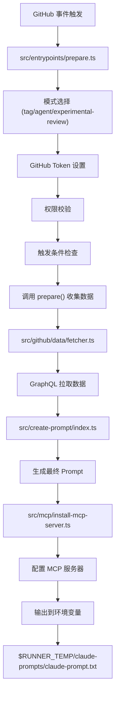
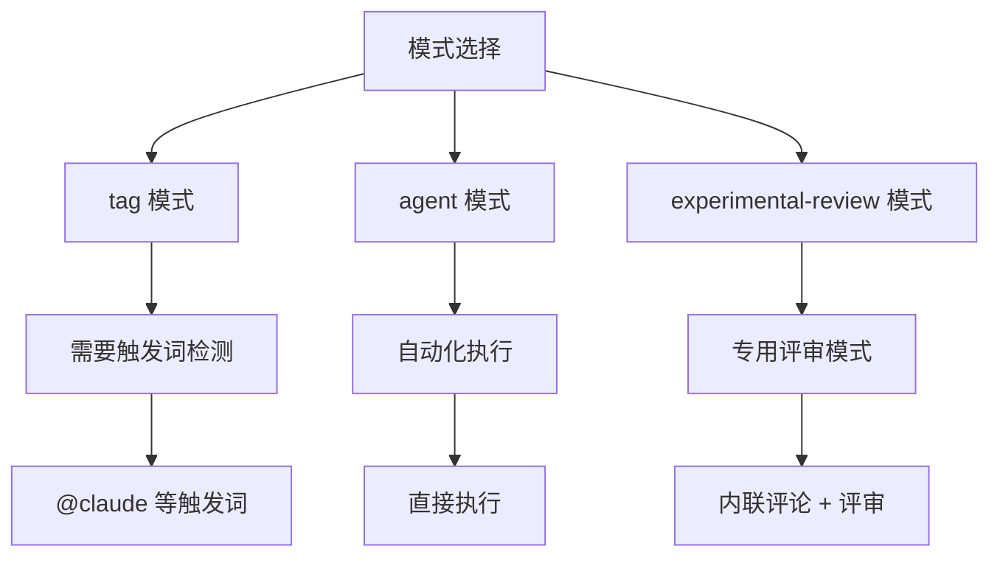
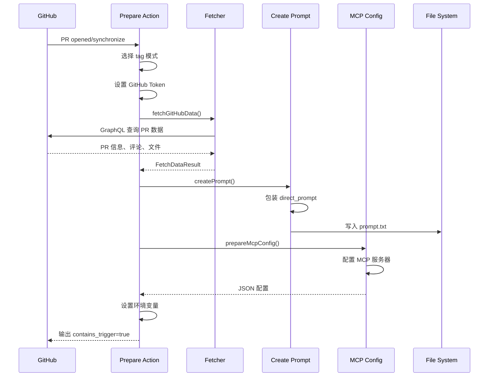

# Prepare 阶段详解

Prepare 阶段是整个 Claude Code Action 的"大脑"部分，负责收集上下文、生成 Prompt 和配置 MCP 工具。本文档详细说明其工作原理、代码结构和数据流。

## 整体架构图



## 详细数据流图

```mermaid
graph LR
    subgraph "输入层"
        A1["GitHub 事件"] --> A2["用户配置"]
        A2 --> A3["环境变量"]
    end
    
    subgraph "解析层"
        B1["src/github/context.ts"] --> B2["事件类型识别"]
        B2 --> B3["权限校验"]
    end
    
    subgraph "数据收集层"
        C1["src/github/data/fetcher.ts"] --> C2["GraphQL 查询"]
        C2 --> C3["PR/Issue 数据"]
        C3 --> C4["评论/评审数据"]
        C4 --> C5["变更文件数据"]
        C5 --> C6["图片下载"]
    end
    
    subgraph "Prompt 生成层"
        D1["src/create-prompt/index.ts"] --> D2["上下文准备"]
        D2 --> D3["模式特定处理"]
        D3 --> D4["变量替换"]
        D4 --> D5["最终 Prompt"]
    end
    
    subgraph "MCP 配置层"
        E1["src/mcp/install-mcp-server.ts"] --> E2["服务器配置"]
        E2 --> E3["权限检查"]
        E3 --> E4["工具列表"]
    end
    
    subgraph "输出层"
        F1["Prompt 文件"] --> F2["MCP 配置"]
        F2 --> F3["环境变量"]
        F3 --> F4["步骤输出"]
    end
    
    A1 --> B1
    A2 --> B1
    A3 --> B1
    B3 --> C1
    C6 --> D1
    D5 --> E1
    E4 --> F1
```



## 核心模块详解

### 1. 主入口：`src/entrypoints/prepare.ts`

```typescript
// 主要职责：协调整个 Prepare 流程
async function run() {
  // 1. 选择模式
  const modeInput = process.env.MODE || DEFAULT_MODE;
  const mode = getMode(validatedMode, context);
  
  // 2. 设置 GitHub Token
  const githubToken = await setupGitHubToken();
  
  // 3. 检查触发条件
  const containsTrigger = mode.shouldTrigger(context);
  
  // 4. 调用 prepare() 收集数据
  const result = await prepare({
    context,
    octokit,
    mode,
    githubToken,
  });
  
  // 5. 设置输出
  core.setOutput("mcp_config", result.mcpConfig);
}
```

### 2. 数据收集：`src/github/data/fetcher.ts`

```typescript
// 核心函数：fetchGitHubData()
export async function fetchGitHubData({
  octokits,
  repository,
  prNumber,
  isPR,
  triggerUsername,
}: FetchDataParams): Promise<FetchDataResult> {
  
  // 收集的数据类型：
  return {
    contextData,        // PR/Issue 基本信息
    comments,           // 所有评论
    changedFiles,       // 变更文件列表
    changedFilesWithSHA, // 含 SHA 的文件列表
    reviewData,         // 评审记录
    imageUrlMap,        // 评论中的图片
    triggerDisplayName,  // 触发用户显示名
  };
}
```

**收集的数据示例：**
```typescript
// PR 数据
{
  title: "Add new feature",
  body: "This PR adds...",
  state: "OPEN",
  files: [
    { path: "src/index.js", changeType: "MODIFIED" },
    { path: "tests/test.js", changeType: "ADDED" }
  ]
}

// 评论数据
[
  { body: "Great work!", user: "alice" },
  { body: "Please review this", user: "bob" }
]
```

### 3. Prompt 生成：`src/create-prompt/index.ts`

```typescript
// 核心函数：createPrompt()
export async function createPrompt(
  mode: Mode,
  modeContext: ModeContext,
  githubData: FetchDataResult,
  context: ParsedGitHubContext,
) {
  // 1. 准备上下文
  const preparedContext = prepareContext(context, ...);
  
  // 2. 生成 Prompt
  const promptContent = generatePrompt(
    preparedContext,
    githubData,
    context.inputs.useCommitSigning,
    mode,
  );
  
  // 3. 写入文件
  await writeFile(
    `${process.env.RUNNER_TEMP}/claude-prompts/claude-prompt.txt`,
    promptContent,
  );
  
  // 4. 设置工具列表
  core.exportVariable("ALLOWED_TOOLS", allAllowedTools);
  core.exportVariable("DISALLOWED_TOOLS", allDisallowedTools);
}
```

**生成的 Prompt 结构：**
```markdown
You are Claude, an AI assistant designed to help with GitHub issues and pull requests.

<formatted_context>
PR #123: Add new feature
Repository: owner/repo
</formatted_context>

<changed_files>
src/index.js (modified)
tests/test.js (added)
</changed_files>

<comments>
- Great work! - @alice
- Please review this - @bob
</comments>

<direct_prompt>
Please review this pull request and provide comprehensive feedback...
</direct_prompt>

Your task is to analyze the context and provide helpful responses...
```

### 4. MCP 配置：`src/mcp/install-mcp-server.ts`

```typescript
// 核心函数：prepareMcpConfig()
export async function prepareMcpConfig(params: PrepareConfigParams): Promise<string> {
  const baseMcpConfig = {
    mcpServers: {
      // 基础评论服务器
      github_comment: {
        command: "bun",
        args: ["run", "src/mcp/github-comment-server.ts"],
        env: { GITHUB_TOKEN, CLAUDE_COMMENT_ID }
      },
      
      // 文件操作服务器（启用 commit signing 时）
      github_file_ops: {
        command: "bun", 
        args: ["run", "src/mcp/github-file-ops-server.ts"],
        env: { GITHUB_TOKEN, BRANCH_NAME, BASE_BRANCH }
      },
      
      // 内联评论服务器（experimental-review 模式）
      github_inline_comment: {
        command: "bun",
        args: ["run", "src/mcp/github-inline-comment-server.ts"],
        env: { GITHUB_TOKEN, PR_NUMBER }
      },
      
      // CI 服务器（有 actions:read 权限时）
      github_ci: {
        command: "bun",
        args: ["run", "src/mcp/github-actions-server.ts"],
        env: { GITHUB_TOKEN, PR_NUMBER }
      }
    }
  };
  
  return JSON.stringify(baseMcpConfig, null, 2);
}
```

## 模式系统

### 模式类型



### 模式特定处理

```typescript
// src/modes/review/index.ts
export const reviewMode: Mode = {
  name: "experimental-review",
  
  shouldTrigger(context) {
    // 仅 PR 事件，特定 action
    return context.isPR && allowedActions.includes(action);
  },
  
  generatePrompt(context, githubData) {
    // 生成评审专用 Prompt
    return `You are Claude, an AI assistant specialized in code reviews...`;
  },
  
  getAllowedTools() {
    return [
      "mcp__github_inline_comment__create_inline_comment",
      "Bash(gh issue comment:*)"
    ];
  }
};
```

## 数据流示例

### 以 `examples/claude-auto-review.yml` 为例



### 关键数据转换

```typescript
// 输入：GitHub 事件
{
  eventName: "pull_request",
  action: "opened", 
  pull_request: { number: 123, title: "Add feature" }
}

// 转换：FetchDataResult
{
  contextData: { title: "Add feature", body: "...", files: [...] },
  comments: [{ body: "Great work!", user: "alice" }],
  changedFiles: [{ path: "src/index.js", changeType: "MODIFIED" }],
  reviewData: { nodes: [] },
  imageUrlMap: new Map(),
  triggerDisplayName: "Alice"
}

// 输出：最终 Prompt
`You are Claude, an AI assistant...
<formatted_context>PR #123: Add feature</formatted_context>
<changed_files>src/index.js (modified)</changed_files>
<direct_prompt>Please review this pull request...</direct_prompt>
...`
```

## 关键文件对应关系

| 功能模块 | 主要文件 | 核心函数 | 职责 |
|----------|----------|----------|------|
| 事件解析 | `src/github/context.ts` | `parseGitHubContext()` | 解析 GitHub 事件类型和数据 |
| 数据拉取 | `src/github/data/fetcher.ts` | `fetchGitHubData()` | GraphQL 查询 PR/Issue 数据 |
| 数据格式化 | `src/github/data/formatter.ts` | `formatContext()`, `formatComments()` | 格式化数据为 Prompt 格式 |
| Prompt 生成 | `src/create-prompt/index.ts` | `createPrompt()`, `generatePrompt()` | 生成最终 Prompt 文件 |
| MCP 配置 | `src/mcp/install-mcp-server.ts` | `prepareMcpConfig()` | 配置 MCP 服务器和工具 |
| 模式处理 | `src/modes/review/index.ts` | `reviewMode.prepare()` | 模式特定的数据处理 |
| 权限校验 | `src/github/validation/permissions.ts` | `checkWritePermissions()` | 校验 GitHub 权限 |


## 总结

Prepare 阶段是整个 Claude Code Action 的核心，它：

1. **收集上下文**：从 GitHub 拉取 PR/Issue 数据、评论、文件变更等
2. **生成 Prompt**：将收集的数据格式化为 Claude 可理解的提示词
3. **配置工具**：设置 MCP 服务器和允许/禁止的工具列表
4. **模式处理**：根据不同的执行模式（tag/agent/review）进行特定处理

这个阶段确保了 Claude 能够获得完整的上下文信息，并具备执行任务所需的工具权限。 