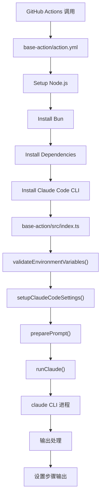
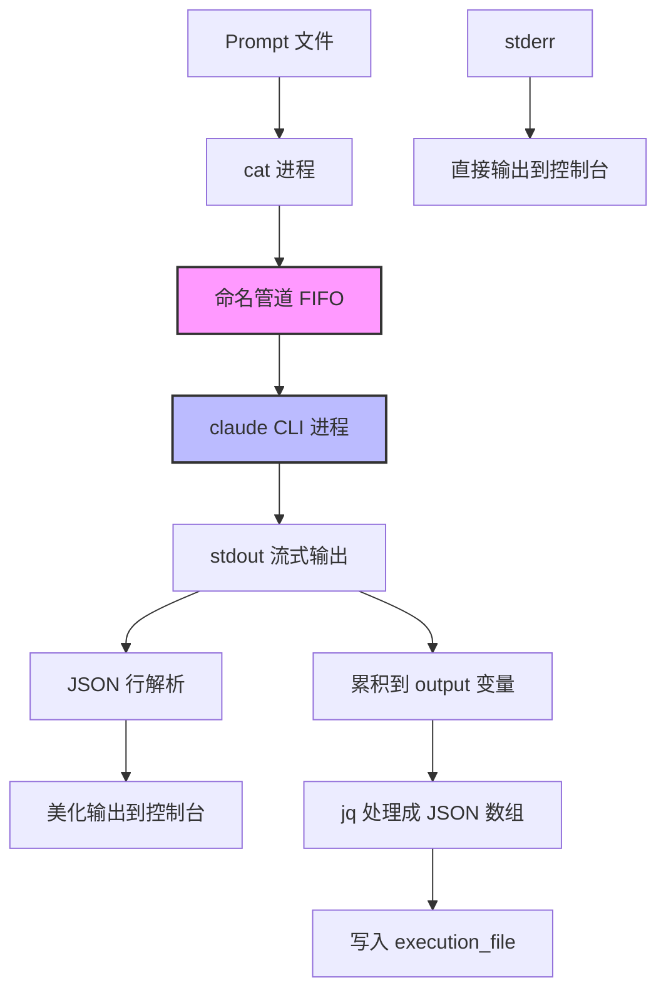
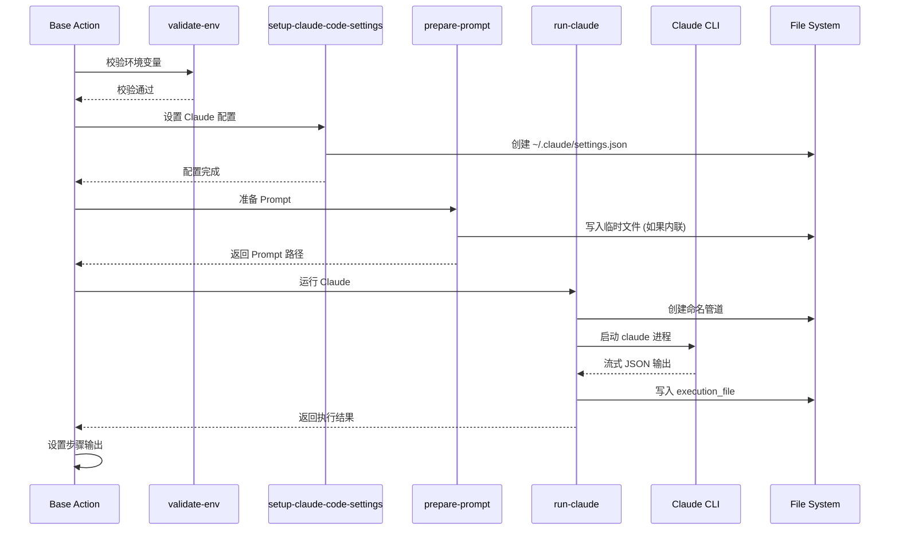

# Base Action 执行器详解

Base Action 是整个 Claude Code Action 的"执行器"部分，负责实际调用 Claude CLI 并处理输入输出。本文档详细说明其工作原理、代码结构和数据流。

## 整体架构图



## 详细执行流程图

```mermaid
graph LR
    subgraph "输入层"
        A1["环境变量"] --> A2["Prompt 文件/内容"]
        A2 --> A3["配置选项"]
    end
    
    subgraph "校验层"
        B1["validate-env.ts"] --> B2["检查 API Key"]
        B2 --> B3["检查云厂商配置"]
        B3 --> B4["校验工具参数"]
    end
    
    subgraph "设置层"
        C1["setup-claude-code-settings.ts"] --> C2["创建 .claude 目录"]
        C2 --> C3["合并配置文件"]
        C3 --> C4["设置 MCP 服务器"]
        C4 --> C5["复制斜杠命令"]
    end
    
    subgraph "Prompt 处理层"
        D1["prepare-prompt.ts"] --> D2["校验 Prompt 输入"]
        D2 --> D3["文件 vs 内联处理"]
        D3 --> D4["创建临时文件"]
    end
    
    subgraph "CLI 执行层"
        E1["run-claude.ts"] --> E2["创建命名管道"]
        E2 --> E3["启动 cat 进程"]
        E3 --> E4["启动 claude 进程"]
        E4 --> E5["流式输出处理"]
        E5 --> E6["超时管理"]
    end
    
    subgraph "输出层"
        F1["执行日志"] --> F2["JSON 聚合"]
        F2 --> F3["步骤输出"]
        F3 --> F4["错误处理"]
    end
    
    A1 --> B1
    A2 --> B1  
    A3 --> B1
    B4 --> C1
    C5 --> D1
    D4 --> E1
    E6 --> F1
```



## 核心模块详解

### 1. 主入口：`base-action/src/index.ts`

```typescript
// 主要职责：协调 Base Action 的完整执行流程
async function run() {
  try {
    // 1. 校验环境变量
    validateEnvironmentVariables();

    // 2. 设置 Claude Code 配置
    await setupClaudeCodeSettings(
      process.env.INPUT_SETTINGS,
      undefined, // homeDir
      process.env.INPUT_EXPERIMENTAL_SLASH_COMMANDS_DIR,
    );

    // 3. 准备 Prompt
    const promptConfig = await preparePrompt({
      prompt: process.env.INPUT_PROMPT || "",
      promptFile: process.env.INPUT_PROMPT_FILE || "",
    });

    // 4. 运行 Claude CLI
    await runClaude(promptConfig.path, {
      allowedTools: process.env.INPUT_ALLOWED_TOOLS,
      disallowedTools: process.env.INPUT_DISALLOWED_TOOLS,
      maxTurns: process.env.INPUT_MAX_TURNS,
      mcpConfig: process.env.INPUT_MCP_CONFIG,
      systemPrompt: process.env.INPUT_SYSTEM_PROMPT,
      appendSystemPrompt: process.env.INPUT_APPEND_SYSTEM_PROMPT,
      claudeEnv: process.env.INPUT_CLAUDE_ENV,
      fallbackModel: process.env.INPUT_FALLBACK_MODEL,
      model: process.env.ANTHROPIC_MODEL,
    });
  } catch (error) {
    core.setFailed(`Action failed with error: ${error}`);
    core.setOutput("conclusion", "failure");
    process.exit(1);
  }
}
```

### 2. 环境校验：`base-action/src/validate-env.ts`

```typescript
// 核心函数：validateEnvironmentVariables()
export function validateEnvironmentVariables() {
  const useBedrock = process.env.CLAUDE_CODE_USE_BEDROCK === "1";
  const useVertex = process.env.CLAUDE_CODE_USE_VERTEX === "1";
  const anthropicApiKey = process.env.ANTHROPIC_API_KEY;
  const claudeCodeOAuthToken = process.env.CLAUDE_CODE_OAUTH_TOKEN;

  const errors: string[] = [];

  // 校验规则：
  // 1. 不能同时使用 Bedrock 和 Vertex
  // 2. 直接 API 需要 API Key 或 OAuth Token
  // 3. Bedrock 需要 AWS 凭证
  // 4. Vertex 需要 GCP 凭证
}
```

**校验的环境变量：**
```bash
# 直接 Anthropic API
ANTHROPIC_API_KEY=sk-ant-...
CLAUDE_CODE_OAUTH_TOKEN=oauth_...

# AWS Bedrock
CLAUDE_CODE_USE_BEDROCK=1
AWS_REGION=us-east-1
AWS_ACCESS_KEY_ID=AKIA...
AWS_SECRET_ACCESS_KEY=...

# Google Vertex AI
CLAUDE_CODE_USE_VERTEX=1
ANTHROPIC_VERTEX_PROJECT_ID=my-project
CLOUD_ML_REGION=us-central1
```

### 3. 设置配置：`base-action/src/setup-claude-code-settings.ts`

```typescript
// 核心函数：setupClaudeCodeSettings()
export async function setupClaudeCodeSettings(
  settingsInput?: string,
  homeDir?: string,
  slashCommandsDir?: string,
) {
  // 1. 创建 ~/.claude 目录
  await $`mkdir -p ${home}/.claude`.quiet();
  
  // 2. 读取现有设置
  let settings: Record<string, unknown> = {};
  try {
    const existingSettings = await $`cat ${settingsPath}`.quiet().text();
    if (existingSettings.trim()) {
      settings = JSON.parse(existingSettings);
    }
  } catch (e) {
    console.log(`No existing settings file found, creating new one`);
  }
  
  // 3. 处理输入设置（JSON 字符串或文件路径）
  if (settingsInput && settingsInput.trim()) {
    let inputSettings = {};
    try {
      inputSettings = JSON.parse(settingsInput);
    } catch (e) {
      const fileContent = await readFile(settingsInput, "utf-8");
      inputSettings = JSON.parse(fileContent);
    }
    settings = { ...settings, ...inputSettings };
  }
  
  // 4. 强制启用 MCP 服务器
  settings.enableAllProjectMcpServers = true;
  
  // 5. 保存设置文件
  await $`echo ${JSON.stringify(settings, null, 2)} > ${settingsPath}`.quiet();
  
  // 6. 复制斜杠命令（如果提供）
  if (slashCommandsDir) {
    await $`cp ${slashCommandsDir}/*.md ${home}/.claude/ 2>/dev/null || true`.quiet();
  }
}
```

### 4. Prompt 准备：`base-action/src/prepare-prompt.ts`

```typescript
// 核心函数：preparePrompt()
export async function preparePrompt(
  input: PreparePromptInput,
): Promise<PreparePromptConfig> {
  // 1. 校验输入
  if (!input.prompt && !input.promptFile) {
    throw new Error("Neither 'prompt' nor 'prompt_file' was provided.");
  }
  
  if (input.prompt && input.promptFile) {
    throw new Error("Both 'prompt' and 'prompt_file' were provided.");
  }
  
  // 2. 处理文件型 Prompt
  if (input.promptFile) {
    if (!existsSync(input.promptFile)) {
      throw new Error(`Prompt file '${input.promptFile}' does not exist.`);
    }
    return { type: "file", path: input.promptFile };
  }
  
  // 3. 处理内联 Prompt
  const inlinePath = "/tmp/claude-action/prompt.txt";
  await createTemporaryPromptFile(input.prompt, inlinePath);
  return { type: "inline", path: inlinePath };
}
```

### 5. CLI 执行：`base-action/src/run-claude.ts`

```typescript
// 核心函数：runClaude()
export async function runClaude(promptPath: string, options: ClaudeOptions) {
  // 1. 准备配置
  const config = prepareRunConfig(promptPath, options);
  
  // 2. 创建命名管道
  await execAsync(`mkfifo "${PIPE_PATH}"`);
  
  // 3. 启动进程组合
  const catProcess = spawn("cat", [config.promptPath]);
  const pipeStream = createWriteStream(PIPE_PATH);
  const claudeProcess = spawn("claude", config.claudeArgs);
  const pipeProcess = spawn("cat", [PIPE_PATH]);
  
  // 4. 连接管道
  catProcess.stdout.pipe(pipeStream);
  pipeProcess.stdout.pipe(claudeProcess.stdin);
  
  // 5. 处理输出
  claudeProcess.stdout.on("data", (data) => {
    const text = data.toString();
    // 尝试美化 JSON 输出
    // 累积所有输出
    output += text;
  });
  
  // 6. 等待完成（带超时）
  const exitCode = await waitForCompletion(claudeProcess, timeoutMs);
  
  // 7. 处理结果
  if (exitCode === 0) {
    await writeFile(EXECUTION_FILE, processedOutput);
    core.setOutput("conclusion", "success");
    core.setOutput("execution_file", EXECUTION_FILE);
  } else {
    core.setOutput("conclusion", "failure");
    process.exit(exitCode);
  }
}
```

## 进程通信架构



### 命名管道的使用原因

1. **大文件支持**：Prompt 可能很大，直接通过 stdin 可能有缓冲区限制
2. **异步处理**：允许同时开始读取和处理
3. **进程隔离**：cat 和 claude 进程独立，更好的错误处理

## Claude CLI 参数构建

```typescript
// prepareRunConfig() 构建的参数示例
const BASE_ARGS = ["-p", "--verbose", "--output-format", "stream-json"];

// 动态添加的参数：
if (options.allowedTools) claudeArgs.push("--allowedTools", options.allowedTools);
if (options.disallowedTools) claudeArgs.push("--disallowedTools", options.disallowedTools);
if (options.maxTurns) claudeArgs.push("--max-turns", options.maxTurns);
if (options.mcpConfig) claudeArgs.push("--mcp-config", options.mcpConfig);
if (options.systemPrompt) claudeArgs.push("--system-prompt", options.systemPrompt);
if (options.appendSystemPrompt) claudeArgs.push("--append-system-prompt", options.appendSystemPrompt);
if (options.fallbackModel) claudeArgs.push("--fallback-model", options.fallbackModel);
if (options.model) claudeArgs.push("--model", options.model);

// 最终命令示例：
// claude -p --verbose --output-format stream-json \
//   --allowedTools "Edit,MultiEdit,Glob,Grep" \
//   --disallowedTools "WebSearch,WebFetch" \
//   --max-turns 10 \
//   --mcp-config "/path/to/mcp-config.json" \
//   --model "claude-3-5-sonnet-20241022"
```

## 数据流示例

### 输入数据转换流程



### 关键文件和路径

```bash
# 临时文件
$RUNNER_TEMP/claude_prompt_pipe          # 命名管道
$RUNNER_TEMP/claude-execution-output.json # 执行日志
/tmp/claude-action/prompt.txt            # 内联 Prompt 临时文件

# 配置文件
~/.claude/settings.json                  # Claude Code 设置
~/.claude/*.md                          # 斜杠命令文件
```

## Action 输入输出

### 核心输入参数

```yaml
inputs:
  # Prompt 相关
  prompt: "直接 Prompt 内容"
  prompt_file: "Prompt 文件路径"
  
  # 工具控制
  allowed_tools: "Edit,MultiEdit,Glob,Grep,LS,Read,Write"
  disallowed_tools: "WebSearch,WebFetch"
  
  # 执行控制
  max_turns: "10"
  timeout_minutes: "30"
  
  # 配置
  mcp_config: "MCP 配置 JSON"
  settings: "Claude Code 设置"
  
  # 模型配置
  model: "claude-3-5-sonnet-20241022"
  fallback_model: "claude-3-haiku-20240307"
  
  # 认证
  anthropic_api_key: "${{ secrets.ANTHROPIC_API_KEY }}"
  use_bedrock: "false"
  use_vertex: "false"
```

### 步骤输出

```yaml
outputs:
  conclusion: "success/failure"
  execution_file: "$RUNNER_TEMP/claude-execution-output.json"
```


## 与主 Action 的集成

### 在主 action.yml 中的调用

```yaml
- name: Run Claude Code
  id: claude-code
  if: steps.prepare.outputs.contains_trigger == 'true'
  shell: bash
  run: |
    # 运行 base-action
    bun run ${GITHUB_ACTION_PATH}/base-action/src/index.ts
  env:
    # 传递所有必要的环境变量
    INPUT_PROMPT_FILE: ${{ runner.temp }}/claude-prompts/claude-prompt.txt
    INPUT_ALLOWED_TOOLS: ${{ env.ALLOWED_TOOLS }}
    INPUT_MCP_CONFIG: ${{ steps.prepare.outputs.mcp_config }}
    ANTHROPIC_MODEL: ${{ inputs.model || inputs.anthropic_model }}
    ANTHROPIC_API_KEY: ${{ inputs.anthropic_api_key }}
```

## 总结

Base Action 是整个 Claude Code Action 的执行核心，它：

1. **环境准备**：校验凭证、设置配置、准备 Prompt
2. **进程管理**：通过命名管道安全地与 Claude CLI 通信
3. **输出处理**：实时美化输出，聚合执行日志
4. **错误处理**：全面的错误捕获和超时管理
5. **性能优化**：流式处理、并行执行、优雅终止

这个模块确保了 Claude CLI 能够在 GitHub Actions 环境中稳定可靠地运行，并提供了丰富的配置选项和监控能力。