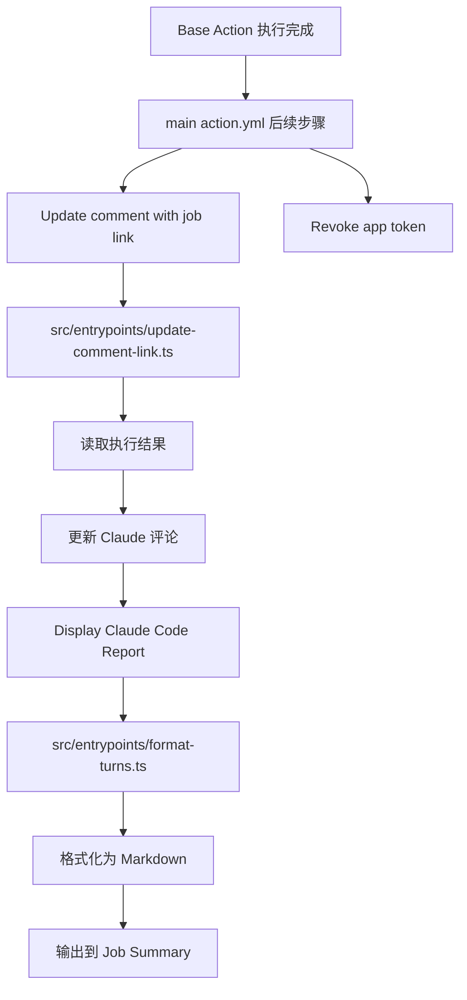
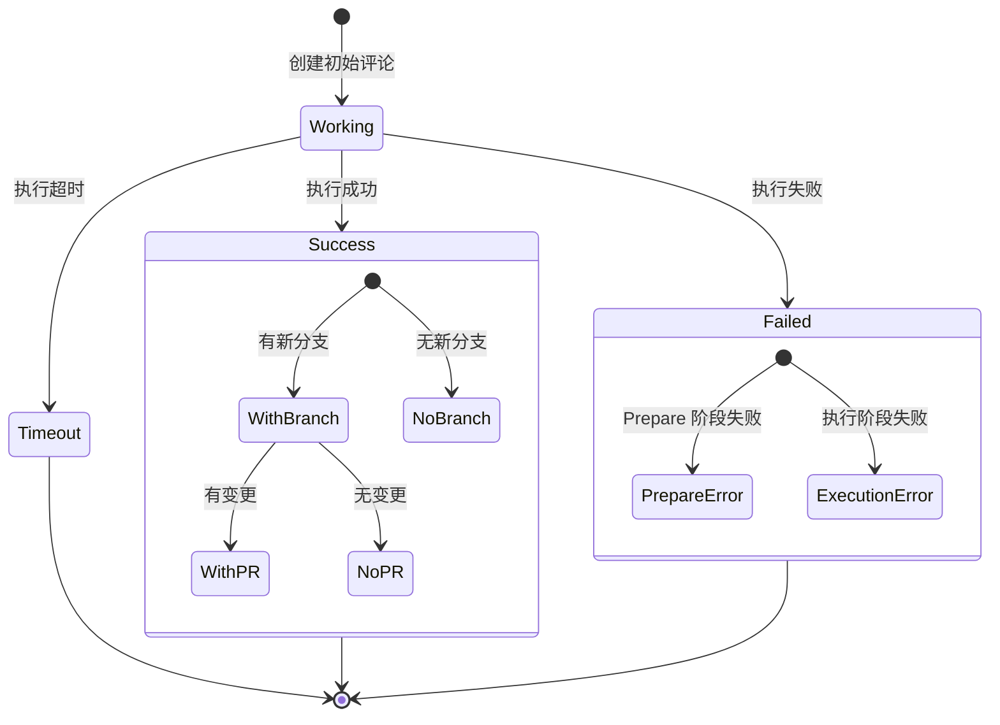
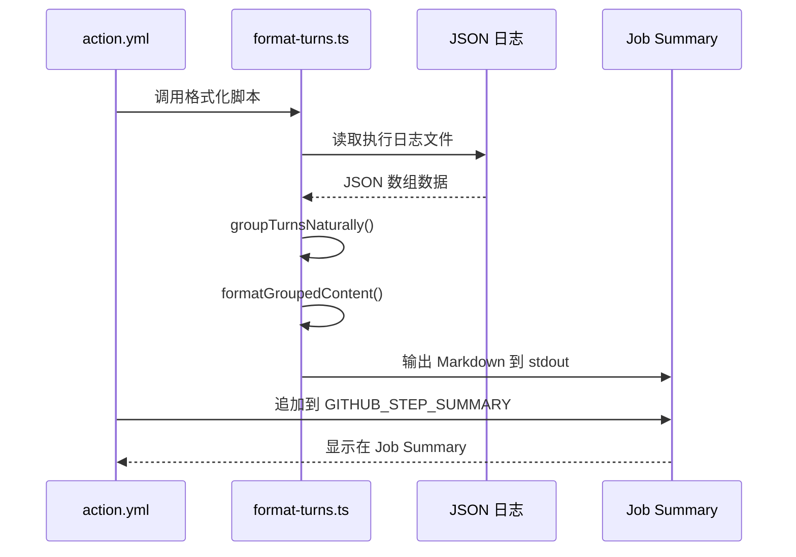
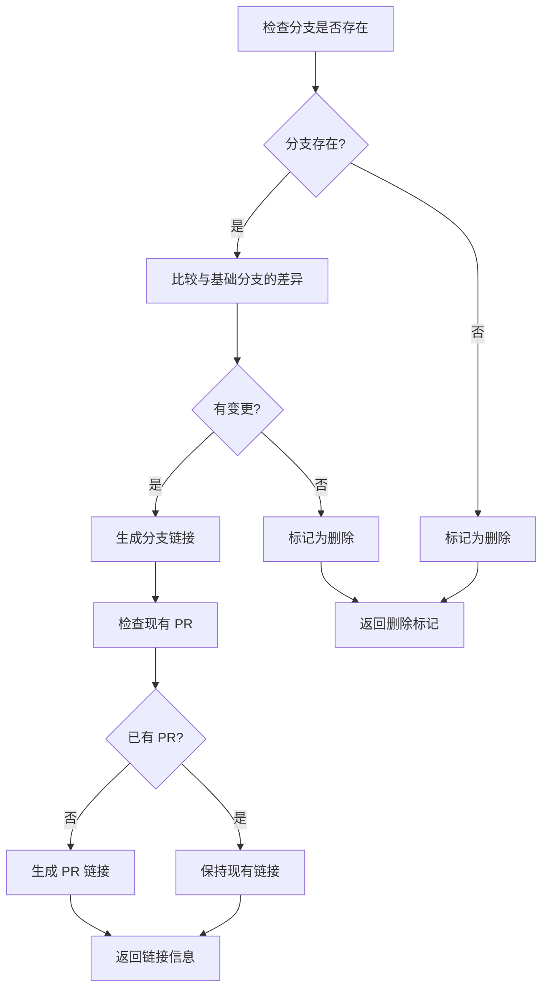
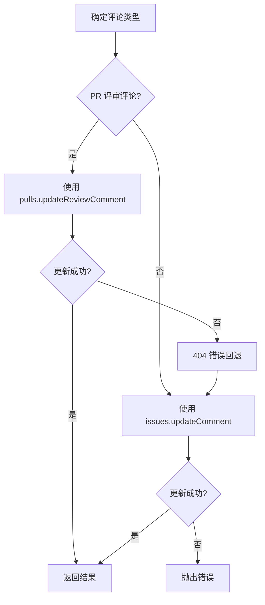

# 回写/展示阶段详解

回写/展示阶段是整个 Claude Code Action 的"反馈环节"，负责将执行结果回写到 GitHub 并格式化展示给用户。本文档详细说明其工作原理、代码结构和数据流。

## 整体架构图



## 详细数据流图

```mermaid
graph LR
    subgraph "输入层"
        A1["执行日志 JSON"] --> A2["环境变量"]
        A2 --> A3["GitHub 评论 ID"]
        A3 --> A4["分支信息"]
    end
    
    subgraph "结果处理层"
        B1["update-comment-link.ts"] --> B2["解析执行状态"]
        B2 --> B3["计算成本/时长"]
        B3 --> B4["检查分支变更"]
        B4 --> B5["生成 PR 链接"]
    end
    
    subgraph "评论更新层"
        C1["comment-logic.ts"] --> C2["解析原始评论"]
        C2 --> C3["构建状态标题"]
        C3 --> C4["拼接链接信息"]
        C4 --> C5["格式化最终内容"]
    end
    
    subgraph "GitHub API 层"
        D1["update-claude-comment.ts"] --> D2["检测评论类型"]
        D2 --> D3["选择正确 API"]
        D3 --> D4["更新评论内容"]
        D4 --> D5["处理 API 错误"]
    end
    
    subgraph "报告生成层"
        E1["format-turns.ts"] --> E2["解析 JSON 数组"]
        E2 --> E3["分组处理 Turn"]
        E3 --> E4["格式化工具调用"]
        E4 --> E5["生成 Markdown"]
    end
    
    subgraph "输出层"
        F1["更新后的评论"] --> F2["Job Summary 报告"]
        F2 --> F3["控制台日志"]
    end
    
    A1 --> B1
    A2 --> B1
    A3 --> B1
    A4 --> B1
    B5 --> C1
    C5 --> D1
    D5 --> F1
    A1 --> E1
    E5 --> F2
```



## 核心模块详解

### 1. 评论更新入口：`src/entrypoints/update-comment-link.ts`

```typescript
// 主要职责：协调评论更新的完整流程
async function run() {
  // 1. 解析环境变量和上下文
  const commentId = parseInt(process.env.CLAUDE_COMMENT_ID!);
  const claudeBranch = process.env.CLAUDE_BRANCH;
  const context = parseGitHubContext();
  
  // 2. 获取现有评论
  let comment;
  let isPRReviewComment = false;
  
  if (isPullRequestReviewCommentEvent(context)) {
    // PR 评审评论
    const { data: prComment } = await octokit.rest.pulls.getReviewComment({
      owner, repo, comment_id: commentId,
    });
    comment = prComment;
    isPRReviewComment = true;
  } else {
    // 普通 Issue/PR 评论
    const { data: issueComment } = await octokit.rest.issues.getComment({
      owner, repo, comment_id: commentId,
    });
    comment = issueComment;
  }
  
  // 3. 检查分支状态和变更
  const { shouldDeleteBranch, branchLink } = await checkAndCommitOrDeleteBranch(
    octokit, owner, repo, claudeBranch, baseBranch, useCommitSigning,
  );
  
  // 4. 生成 PR 链接（如果有新分支和变更）
  let prLink = "";
  if (claudeBranch && !shouldDeleteBranch) {
    const { data: comparison } = await octokit.rest.repos.compareCommitsWithBasehead({
      owner, repo, basehead: `${baseBranch}...${claudeBranch}`,
    });
    
    if (comparison.total_commits > 0 || comparison.files?.length > 0) {
      const prUrl = `${serverUrl}/${owner}/${repo}/compare/${baseBranch}...${claudeBranch}?quick_pull=1&title=${prTitle}&body=${prBody}`;
      prLink = `\n[Create a PR](${prUrl})`;
    }
  }
  
  // 5. 解析执行结果
  let executionDetails = null;
  let actionFailed = false;
  
  const outputFile = process.env.OUTPUT_FILE;
  if (outputFile) {
    const outputData = JSON.parse(await fs.readFile(outputFile, "utf8"));
    if (Array.isArray(outputData) && outputData.length > 0) {
      const lastElement = outputData[outputData.length - 1];
      if (lastElement.type === "result") {
        executionDetails = {
          cost_usd: lastElement.cost_usd,
          duration_ms: lastElement.duration_ms,
          duration_api_ms: lastElement.duration_api_ms,
        };
      }
    }
    actionFailed = process.env.CLAUDE_SUCCESS !== "false";
  }
  
  // 6. 更新评论
  const commentInput = {
    currentBody: comment.body,
    actionFailed,
    executionDetails,
    jobUrl,
    branchLink,
    prLink,
    branchName: claudeBranch,
    triggerUsername,
    errorDetails,
  };
  
  const updatedBody = updateCommentBody(commentInput);
  
  await updateClaudeComment(octokit.rest, {
    owner, repo, commentId,
    body: updatedBody,
    isPullRequestReviewComment,
  });
}
```

### 2. 评论逻辑：`src/github/operations/comment-logic.ts`

```typescript
// 核心函数：updateCommentBody()
export function updateCommentBody(input: CommentUpdateInput): string {
  const { currentBody, actionFailed, executionDetails, jobUrl, branchLink, prLink, triggerUsername } = input;
  
  // 1. 清理原始评论内容
  const workingPattern = /Claude Code is working[…\.]{1,3}(?:\s*]*>)?/i;
  let bodyContent = currentBody.replace(workingPattern, "").trim();
  
  // 2. 提取已有的 PR 链接
  const prLinkPattern = /\[Create .* PR\]\((.*)\)$/m;
  const prLinkMatch = bodyContent.match(prLinkPattern);
  let prLinkFromContent = "";
  if (prLinkMatch && prLinkMatch[1]) {
    prLinkFromContent = ensureProperlyEncodedUrl(prLinkMatch[1]);
    bodyContent = bodyContent.replace(prLinkMatch[0], "").trim();
  }
  
  // 3. 计算执行时长
  let durationStr = "";
  if (executionDetails?.duration_ms) {
    const totalSeconds = Math.round(executionDetails.duration_ms / 1000);
    const minutes = Math.floor(totalSeconds / 60);
    const seconds = totalSeconds % 60;
    durationStr = minutes > 0 ? `${minutes}m ${seconds}s` : `${seconds}s`;
  }
  
  // 4. 构建状态标题
  let header = "";
  if (actionFailed) {
    header = `**Claude encountered an error${durationStr ? ` after ${durationStr}` : ""}**`;
  } else {
    const username = triggerUsername || "user";
    header = `**Claude finished @${username}'s task${durationStr ? ` in ${durationStr}` : ""}**`;
  }
  
  // 5. 拼接链接信息
  let links = ` —— [View job](${jobUrl})`;
  
  // 添加分支链接
  if (branchName && branchUrl) {
    links += ` • [\`${branchName}\`](${branchUrl})`;
  }
  
  // 添加 PR 链接
  const prUrl = prLinkFromContent || prLink?.match(/\(([^)]+)\)/)?.[1];
  if (prUrl) {
    links += ` • [Create PR ➔](${prUrl})`;
  }
  
  // 6. 组装最终内容
  let newBody = `${header}${links}`;
  
  if (actionFailed && errorDetails) {
    newBody += `\n\n\`\`\`\n${errorDetails}\n\`\`\``;
  }
  
  newBody += `\n\n---\n${bodyContent}`;
  
  return newBody.trim();
}
```

### 3. GitHub API 适配：`src/github/operations/comments/update-claude-comment.ts`

```typescript
// 核心函数：updateClaudeComment()
export async function updateClaudeComment(
  octokit: Octokit,
  params: UpdateClaudeCommentParams,
): Promise<UpdateClaudeCommentResult> {
  const { owner, repo, commentId, body, isPullRequestReviewComment } = params;
  
  let response;
  
  try {
    if (isPullRequestReviewComment) {
      // 尝试 PR 评审评论 API
      response = await octokit.rest.pulls.updateReviewComment({
        owner, repo, comment_id: commentId, body,
      });
    } else {
      // 使用 Issue 评论 API（适用于 Issue 和 PR 普通评论）
      response = await octokit.rest.issues.updateComment({
        owner, repo, comment_id: commentId, body,
      });
    }
  } catch (error: any) {
    // 如果 PR 评审评论更新失败（404），回退到 Issue 评论 API
    if (isPullRequestReviewComment && error.status === 404) {
      response = await octokit.rest.issues.updateComment({
        owner, repo, comment_id: commentId, body,
      });
    } else {
      throw error;
    }
  }
  
  return {
    id: response.data.id,
    html_url: response.data.html_url,
    updated_at: response.data.updated_at,
  };
}
```

### 4. 报告格式化：`src/entrypoints/format-turns.ts`

```typescript
// 核心函数：formatTurnsFromData()
export function formatTurnsFromData(data: Turn[]): string {
  // 1. 自然分组 Turns
  const groupedContent = groupTurnsNaturally(data);
  
  // 2. 生成 Markdown
  const markdown = formatGroupedContent(groupedContent);
  
  return markdown;
}

// 分组逻辑
export function groupTurnsNaturally(data: Turn[]): GroupedContent[] {
  const groupedContent: GroupedContent[] = [];
  const toolResultsMap = new Map<string, ToolResult>();
  
  // 第一轮：收集所有工具结果
  for (const turn of data) {
    if (turn.type === "user") {
      const content = turn.message?.content || [];
      for (const item of content) {
        if (item.type === "tool_result" && item.tool_use_id) {
          toolResultsMap.set(item.tool_use_id, {
            type: item.type,
            tool_use_id: item.tool_use_id,
            content: item.content,
            is_error: item.is_error,
          });
        }
      }
    }
  }
  
  // 第二轮：处理和分组
  for (const turn of data) {
    const turnType = turn.type || "unknown";
    
    if (turnType === "system" && turn.subtype === "init") {
      groupedContent.push({
        type: "system_init",
        tools_count: (turn.tools || []).length,
      });
    } else if (turnType === "assistant") {
      const message = turn.message || { content: [] };
      const content = message.content || [];
      
      const textParts: string[] = [];
      const toolCalls: { tool_use: ToolUse; tool_result?: ToolResult }[] = [];
      
      for (const item of content) {
        if (item.type === "text") {
          textParts.push(item.text || "");
        } else if (item.type === "tool_use") {
          const toolResult = item.id ? toolResultsMap.get(item.id) : undefined;
          toolCalls.push({
            tool_use: { type: item.type, name: item.name, input: item.input, id: item.id },
            tool_result: toolResult,
          });
        }
      }
      
      groupedContent.push({
        type: "assistant_action",
        text_parts: textParts,
        tool_calls: toolCalls,
        usage: message.usage,
      });
    } else if (turnType === "result") {
      groupedContent.push({
        type: "final_result",
        data: turn,
      });
    }
  }
  
  return groupedContent;
}

// Markdown 格式化
export function formatGroupedContent(groupedContent: GroupedContent[]): string {
  let markdown = "## Claude Code Report\n\n";
  
  for (const item of groupedContent) {
    if (item.type === "system_init") {
      markdown += `## 🚀 System Initialization\n\n**Available Tools:** ${item.tools_count} tools loaded\n\n---\n\n`;
    } else if (item.type === "assistant_action") {
      // 添加文本内容
      for (const text of item.text_parts || []) {
        if (text.trim()) {
          markdown += `${text}\n\n`;
        }
      }
      
      // 添加工具调用和结果
      for (const toolCall of item.tool_calls || []) {
        markdown += formatToolWithResult(toolCall.tool_use, toolCall.tool_result);
      }
      
      // 添加 Token 使用信息
      const usage = item.usage || {};
      if (Object.keys(usage).length > 0) {
        const inputTokens = (usage.input_tokens || 0) + (usage.cache_creation_input_tokens || 0) + (usage.cache_read_input_tokens || 0);
        const outputTokens = usage.output_tokens || 0;
        markdown += `*Token usage: ${inputTokens} input, ${outputTokens} output*\n\n`;
      }
      
      markdown += "---\n\n";
    } else if (item.type === "final_result") {
      const data = item.data || {};
      const cost = data.total_cost_usd || data.cost_usd || 0;
      const duration = data.duration_ms || 0;
      const resultText = data.result || "";
      
      markdown += "## ✅ Final Result\n\n";
      if (resultText) {
        markdown += `${resultText}\n\n`;
      }
      markdown += `**Cost:** $${cost.toFixed(4)} | **Duration:** ${(duration / 1000).toFixed(1)}s\n\n`;
    }
  }
  
  return markdown;
}
```

## 评论状态转换流程



### 评论内容演变示例

```markdown
<!-- 初始状态 -->
Claude Code is working… 

---

@user's request content here

<!-- 成功完成（有分支） -->
**Claude finished @user's task in 2m 15s** —— [View job](job-url) • [`claude/feature-123`](branch-url) • [Create PR ➔](pr-url)

---

@user's request content here

<!-- 失败状态 -->
**Claude encountered an error after 45s** —— [View job](job-url)

```
Environment variable validation failed:
  - ANTHROPIC_API_KEY is required when using direct Anthropic API.
```

---

@user's request content here
```

## 执行报告生成流程



### 报告内容结构

```markdown
## Claude Code Report

## 🚀 System Initialization

**Available Tools:** 15 tools loaded

---

I'll help you review this pull request. Let me start by examining the changes.

### 🔧 `Read`

**Parameters:**
```json
{
  "path": "src/index.js"
}
```

**Result:**
```javascript
function hello() {
  console.log("Hello, World!");
}
```

---

### 🔧 `Edit`

**Parameters:**
```json
{
  "path": "src/index.js",
  "new_string": "// Fixed typo\nfunction hello() {\n  console.log(\"Hello, World!\");\n}"
}
```

**→** File edited successfully

*Token usage: 1250 input, 340 output*

---

## ✅ Final Result

I've reviewed your pull request and made one small improvement to fix a typo in the comment.

**Cost:** $0.0023 | **Duration:** 12.5s
```

## 分支管理和 PR 链接生成

### 分支状态检查流程



### PR 链接构建逻辑

```typescript
// 构建 PR 创建链接
const entityType = context.isPR ? "PR" : "Issue";
const prTitle = encodeURIComponent(
  `${entityType} #${context.entityNumber}: Changes from Claude`,
);
const prBody = encodeURIComponent(
  `This PR addresses ${entityType.toLowerCase()} #${context.entityNumber}\n\nGenerated with [Claude Code](https://claude.ai/code)`,
);
const prUrl = `${serverUrl}/${owner}/${repo}/compare/${baseBranch}...${claudeBranch}?quick_pull=1&title=${prTitle}&body=${prBody}`;
```

## API 兼容性处理

### GitHub 评论 API 的复杂性



**API 差异说明：**
- **Issue 评论**：`/repos/{owner}/{repo}/issues/comments/{comment_id}`
- **PR 普通评论**：同 Issue 评论 API
- **PR 评审评论**：`/repos/{owner}/{repo}/pulls/comments/{comment_id}`
- **评审回复评论**：`/repos/{owner}/{repo}/pulls/comments/{comment_id}`


## 与主 Action 的集成

### 在主 action.yml 中的调用

```yaml
- name: Update comment with job link
  if: steps.prepare.outputs.contains_trigger == 'true' && steps.prepare.outputs.claude_comment_id && always()
  shell: bash
  run: |
    bun run ${GITHUB_ACTION_PATH}/src/entrypoints/update-comment-link.ts
  env:
    CLAUDE_COMMENT_ID: ${{ steps.prepare.outputs.claude_comment_id }}
    CLAUDE_BRANCH: ${{ steps.prepare.outputs.CLAUDE_BRANCH }}
    GITHUB_TOKEN: ${{ steps.prepare.outputs.GITHUB_TOKEN }}
    CLAUDE_SUCCESS: ${{ steps.claude-code.outputs.conclusion == 'success' }}
    OUTPUT_FILE: ${{ steps.claude-code.outputs.execution_file }}

- name: Display Claude Code Report
  if: steps.prepare.outputs.contains_trigger == 'true' && steps.claude-code.outputs.execution_file != ''
  shell: bash
  run: |
    if bun run ${{ github.action_path }}/src/entrypoints/format-turns.ts "${{ steps.claude-code.outputs.execution_file }}" >> $GITHUB_STEP_SUMMARY 2>/dev/null; then
      echo "Successfully formatted Claude Code report"
    else
      echo "## Claude Code Report (Raw Output)" >> $GITHUB_STEP_SUMMARY
      echo "Failed to format output. Here's the raw JSON:" >> $GITHUB_STEP_SUMMARY
      echo '```json' >> $GITHUB_STEP_SUMMARY
      cat "${{ steps.claude-code.outputs.execution_file }}" >> $GITHUB_STEP_SUMMARY
      echo '```' >> $GITHUB_STEP_SUMMARY
    fi
```

## 总结

回写/展示阶段是整个 Claude Code Action 的用户体验关键，它：

1. **状态反馈**：将执行结果和状态回写到 GitHub 评论
2. **链接生成**：智能生成分支链接和 PR 创建链接
3. **报告格式化**：将执行日志转换为用户友好的 Markdown 报告
4. **API 适配**：处理 GitHub 不同类型评论的 API 差异
5. **错误处理**：全面的错误捕获和优雅降级

这个阶段确保了用户能够清晰地了解 Claude 的执行结果，并提供便捷的后续操作入口（如创建 PR），形成了完整的用户交互闭环。