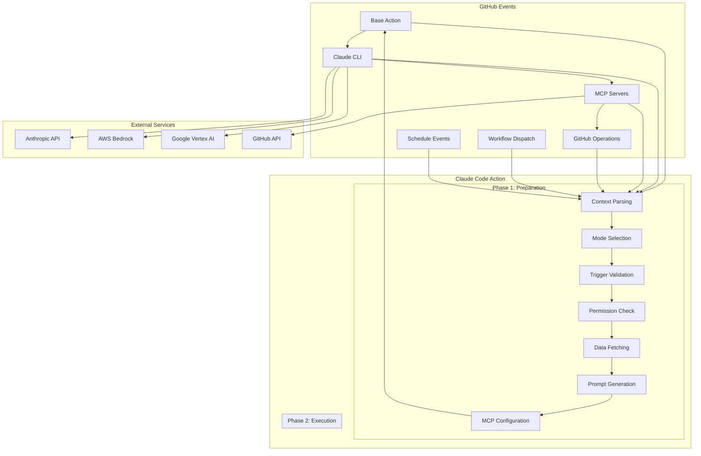
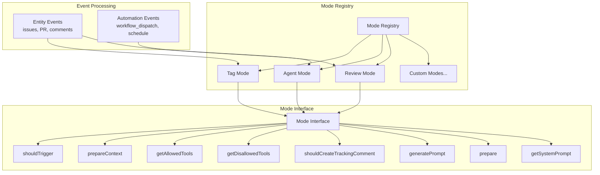
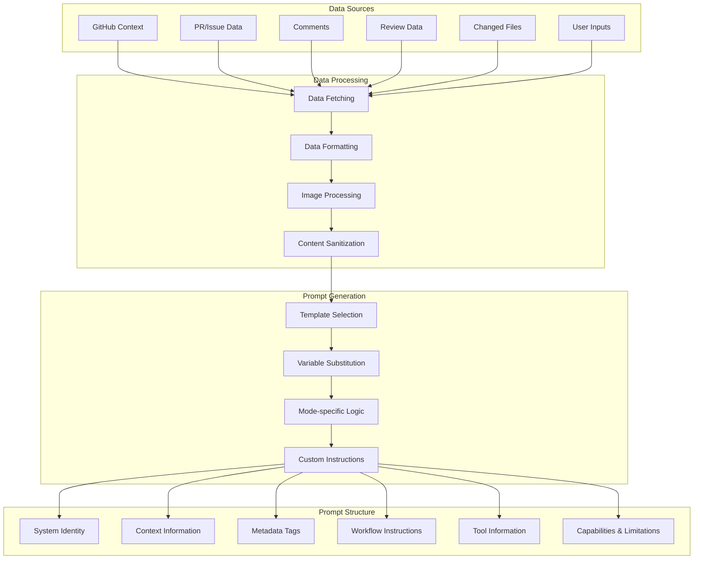
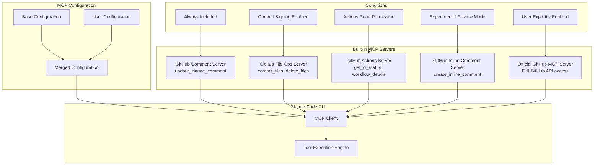
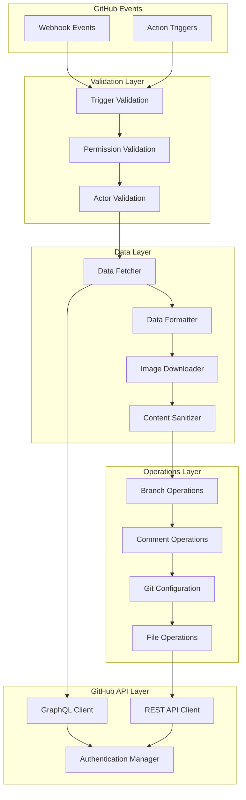
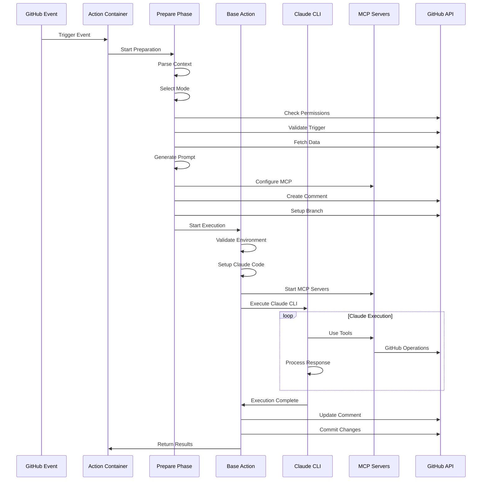
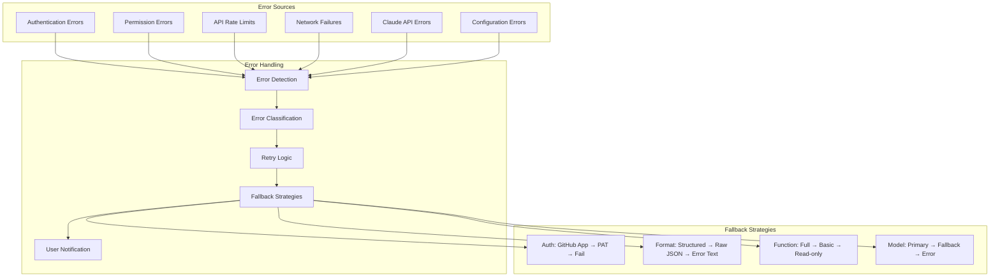
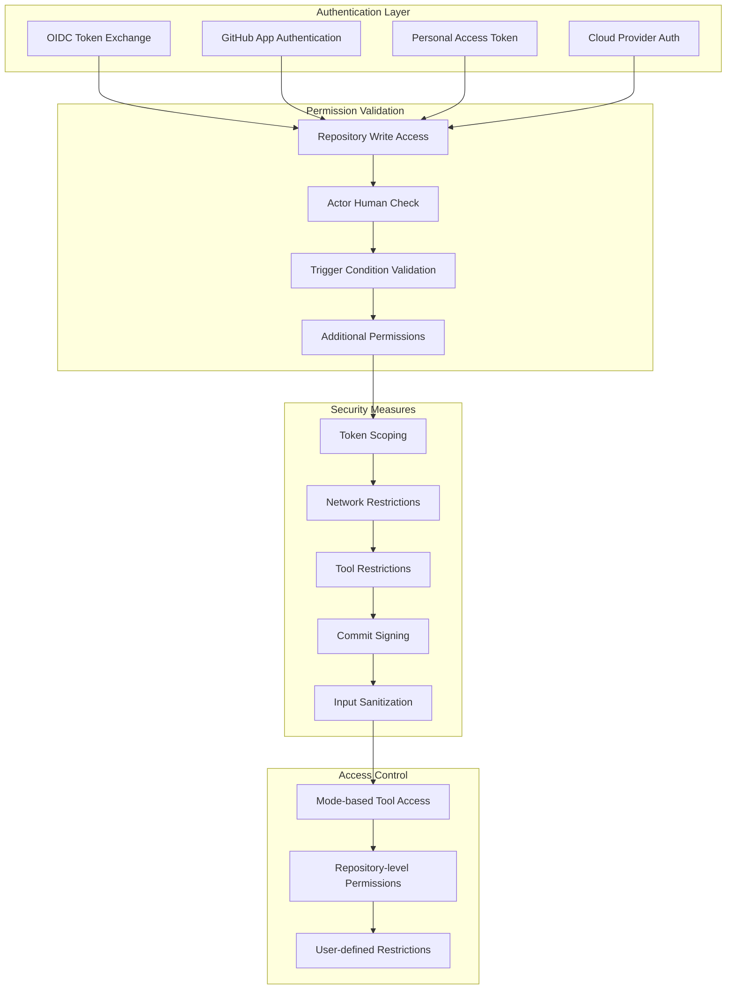
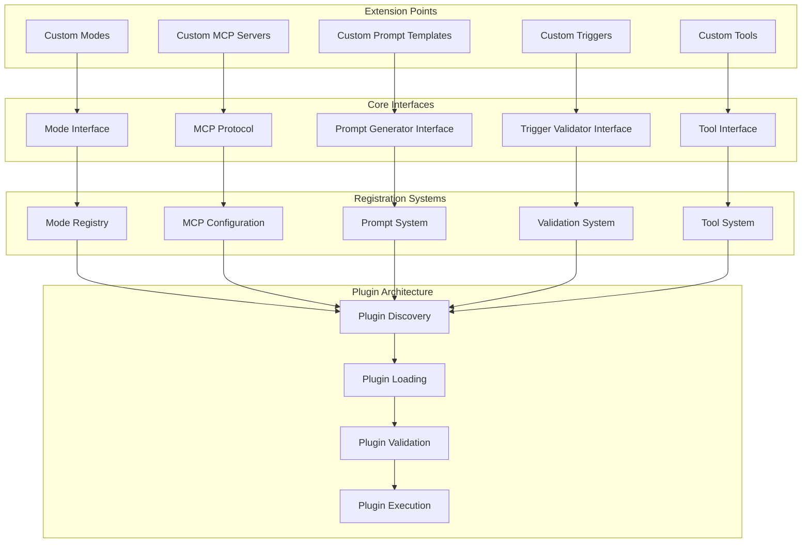
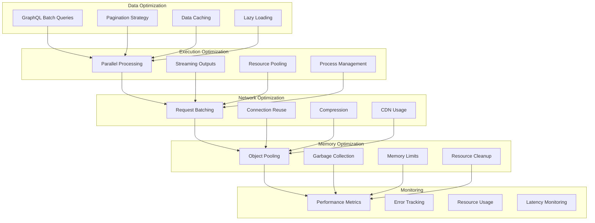

# Claude Code Action 架构图集

## 1. 整体系统架构图

## 2. 模式系统架构图

## 3. Prompt 系统架构图

## 4. MCP 工具系统架构图

## 5. GitHub 集成层架构图

## 6. 工作流程详细流程图

## 7. 错误处理和降级机制图

## 8. 安全和权限架构图

## 9. 扩展性架构图

## 10. 性能优化架构图

