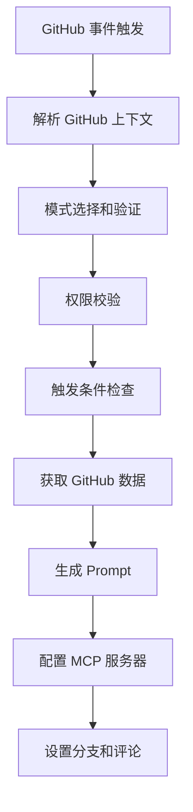
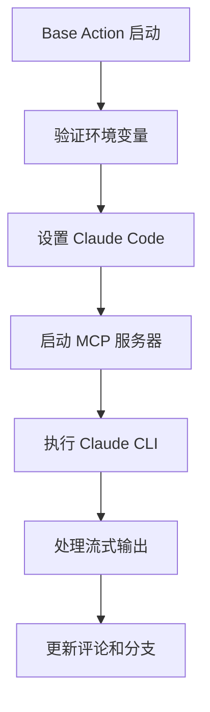

# Claude Code Action 架构调研报告

## 项目概述

**Claude Code Action** 是一个通用的 GitHub Action，能够让 Claude AI 与 GitHub PR 和 Issue 进行交互，回答问题并实现代码变更。该项目支持多种认证方式，包括 Anthropic 直接 API、Amazon Bedrock 和 Google Vertex AI。

### 核心特性
- 🤖 **交互式代码助手**: 回答代码、架构和编程问题
- 🔍 **代码审查**: 分析 PR 变更并提供改进建议
- ✨ **代码实现**: 实现简单修复、重构甚至新功能
- 💬 **PR/Issue 集成**: 与 GitHub 评论和 PR 审查无缝集成
- 🛠️ **灵活的工具访问**: 访问 GitHub API 和文件操作
- 📋 **进度跟踪**: 动态更新的进度指示器和复选框

## 整体架构设计

### 1. 架构分层

项目采用**分层架构**，从底层到顶层包含以下几个层次：

```
┌─────────────────────────────────────┐
│           GitHub Action Layer       │  ← action.yml 工作流定义
├─────────────────────────────────────┤
│           Entrypoints Layer         │  ← 入口点和流程控制
├─────────────────────────────────────┤
│              Mode Layer             │  ← 模式系统（tag/agent/review）
├─────────────────────────────────────┤
│            Business Layer           │  ← GitHub 集成、提示生成、MCP
├─────────────────────────────────────┤
│         Infrastructure Layer        │  ← 基础设施和工具
└─────────────────────────────────────┘
```

### 2. 核心执行流程

整个系统采用**两阶段执行模式**：

#### 阶段1: 准备阶段 (Preparation Phase)


#### 阶段2: 执行阶段 (Execution Phase)


### 3. 目录结构分析

```
claude-code-action/
├── src/                        # 主要业务逻辑
│   ├── entrypoints/            # 入口点
│   │   ├── prepare.ts          # 准备阶段主入口
│   │   ├── update-comment-link.ts  # 评论更新
│   │   └── format-turns.ts     # 输出格式化
│   ├── modes/                  # 模式系统
│   │   ├── registry.ts         # 模式注册表
│   │   ├── types.ts           # 模式接口定义
│   │   ├── tag/               # 标签模式
│   │   ├── agent/             # 代理模式
│   │   └── review/            # 审查模式
│   ├── github/                # GitHub 集成层
│   │   ├── api/               # API 客户端
│   │   ├── data/              # 数据获取和格式化
│   │   ├── operations/        # 操作层（分支、评论、Git）
│   │   ├── validation/        # 验证逻辑
│   │   └── utils/             # 工具函数
│   ├── create-prompt/         # 提示生成系统
│   ├── mcp/                   # MCP 工具系统
│   └── prepare/               # 准备阶段逻辑
├── base-action/               # 执行器（独立项目）
└── docs/                      # 文档
```

## 核心系统详解

### 1. 模式系统 (Mode System)

#### 设计理念
模式系统采用**策略模式**，支持不同的执行策略：

```typescript
export type Mode = {
  name: ModeName;
  description: string;
  shouldTrigger(context: GitHubContext): boolean;
  prepareContext(context: GitHubContext, data?: ModeData): ModeContext;
  getAllowedTools(): string[];
  getDisallowedTools(): string[];
  shouldCreateTrackingComment(): boolean;
  generatePrompt(context: PreparedContext, githubData: FetchDataResult, useCommitSigning: boolean): string;
  prepare(options: ModeOptions): Promise<ModeResult>;
  getSystemPrompt?(context: ModeContext): string | undefined;
};
```

#### 三种模式

1. **Tag 模式** (`tag`)
   - **用途**: 传统的 @claude 提及触发
   - **特点**: 完整的实现功能，创建跟踪评论
   - **触发条件**: 评论中包含触发短语、Issue 分配、标签添加

2. **Agent 模式** (`agent`) 
   - **用途**: 自动化工作流，无需触发检查
   - **特点**: 用于 workflow_dispatch 和 schedule 事件
   - **触发条件**: 总是触发

3. **实验性审查模式** (`experimental-review`)
   - **用途**: 代码审查，支持内联评论
   - **特点**: 专门的审查工具，不创建跟踪评论
   - **触发条件**: 类似 Tag 模式但优化审查功能

#### 模式扩展机制
```typescript
// 1. 在 VALID_MODES 中添加新模式
export const VALID_MODES = ["tag", "agent", "experimental-review", "new-mode"] as const;

// 2. 实现 Mode 接口
export const newMode: Mode = {
  name: "new-mode",
  // ... 实现所有必需方法
};

// 3. 在注册表中注册
const modes = {
  tag: tagMode,
  agent: agentMode,
  "experimental-review": reviewMode,
  "new-mode": newMode,
} as const;
```

### 2. Prompt 系统

#### 架构设计
Prompt 系统采用**模板+变量替换**的设计：

```typescript
// 核心变量替换系统
const variables: Record<string, string> = {
  REPOSITORY: context.repository,
  PR_NUMBER: eventData.isPR && "prNumber" in eventData ? eventData.prNumber : "",
  ISSUE_NUMBER: !eventData.isPR && "issueNumber" in eventData ? eventData.issueNumber : "",
  PR_TITLE: eventData.isPR && contextData?.title ? contextData.title : "",
  ISSUE_TITLE: !eventData.isPR && contextData?.title ? contextData.title : "",
  // ... 更多变量
};

function substitutePromptVariables(template: string, context: PreparedContext, githubData: FetchDataResult): string {
  let result = template;
  for (const [key, value] of Object.entries(variables)) {
    const regex = new RegExp(`\\$${key}`, "g");
    result = result.replace(regex, value);
  }
  return result;
}
```

#### Prompt 结构层次

1. **基础信息层**
```xml
<formatted_context>${formattedContext}</formatted_context>
<pr_or_issue_body>${formattedBody}</pr_or_issue_body>
<comments>${formattedComments}</comments>
<review_comments>${formattedReviewComments}</review_comments>
<changed_files>${formattedChangedFiles}</changed_files>
```

2. **元数据层**
```xml
<event_type>${eventType}</event_type>
<is_pr>${eventData.isPR}</is_pr>
<trigger_context>${triggerContext}</trigger_context>
<repository>${context.repository}</repository>
<claude_comment_id>${context.claudeCommentId}</claude_comment_id>
<trigger_username>${context.triggerUsername}</trigger_username>
```

3. **指令层**
```xml
<trigger_comment>${sanitizeContent(eventData.commentBody)}</trigger_comment>
<direct_prompt>高优先级直接指令</direct_prompt>
<comment_tool_info>工具使用说明</comment_tool_info>
```

#### 工作流程指令

Prompt 包含详细的**5步工作流程**：

1. **创建待办清单**: 使用 GitHub 评论维护任务列表
2. **收集上下文**: 分析预获取的数据，读取 CLAUDE.md
3. **理解请求**: 提取实际问题或请求，分类处理
4. **执行操作**: 
   - A. 回答问题和代码审查
   - B. 简单变更
   - C. 复杂变更
5. **最终更新**: 更新评论状态，提供 PR 链接

#### Prompt 定制能力

1. **变量替换**: 支持 16+ 个内置变量
2. **模式特定**: 每个模式可以有自己的 prompt 生成器
3. **覆盖机制**: 支持完全覆盖默认 prompt
4. **自定义指令**: 支持追加自定义指令
5. **系统提示**: 模式可以添加特定的系统提示

### 3. MCP 工具系统

#### 架构设计
MCP (Model Context Protocol) 系统提供 **Claude 与外部系统交互的能力**：

```typescript
// MCP 服务器配置结构
type McpConfig = {
  mcpServers: {
    [serverName: string]: {
      command: string;
      args: string[];
      env: Record<string, string>;
    };
  };
};
```

#### 内置 MCP 服务器

1. **GitHub 评论服务器** (`github-comment-server.ts`)
   - **功能**: 更新 Claude 评论
   - **工具**: `update_claude_comment`
   - **必需**: 所有模式都包含

2. **GitHub 文件操作服务器** (`github-file-ops-server.ts`)
   - **功能**: 文件提交和删除
   - **工具**: `commit_files`, `delete_files`
   - **条件**: 启用提交签名时使用

3. **GitHub Actions 服务器** (`github-actions-server.ts`)
   - **功能**: 访问工作流和 CI 状态
   - **工具**: `get_ci_status`, `get_workflow_run_details`, `download_job_log`
   - **条件**: 有 actions:read 权限且为 PR 时

4. **GitHub 内联评论服务器** (`github-inline-comment-server.ts`)
   - **功能**: 创建 PR 内联评论
   - **工具**: `create_inline_comment`
   - **条件**: 实验性审查模式

5. **官方 GitHub MCP 服务器**
   - **功能**: 完整的 GitHub API 访问
   - **实现**: Docker 容器方式
   - **条件**: 用户显式启用时

#### MCP 配置合并机制

```typescript
// 基础配置 + 用户配置 = 最终配置
const mergedConfig = {
  ...baseMcpConfig,
  ...additionalConfig,
  mcpServers: {
    ...baseMcpConfig.mcpServers,      // 内置服务器
    ...additionalConfig.mcpServers,   // 用户自定义服务器
  },
};
```

### 4. GitHub 集成层

#### 数据获取架构

```typescript
// 统一的数据获取接口
export type FetchDataResult = {
  contextData: GitHubPullRequest | GitHubIssue;    // PR/Issue 主体数据
  comments: GitHubComment[];                        // 评论列表
  changedFiles: GitHubFile[];                       // 变更文件
  changedFilesWithSHA: GitHubFileWithSHA[];        // 带 SHA 的变更文件
  reviewData: { nodes: GitHubReview[] } | null;    // 审查数据
  imageUrlMap: Map<string, string>;                // 图片 URL 映射
  triggerDisplayName?: string | null;               // 触发用户显示名称
};
```

#### GraphQL 查询策略

项目使用**GraphQL 批量查询**来获取所有需要的数据：

```graphql
# PR 查询示例
query GetPullRequest($owner: String!, $repo: String!, $number: Int!) {
  repository(owner: $owner, name: $repo) {
    pullRequest(number: $number) {
      title
      body
      comments(first: 100) { nodes { ... } }
      reviews(first: 100) { nodes { ... } }
      files(first: 100) { nodes { ... } }
    }
  }
}
```

#### 数据格式化系统

```typescript
// 格式化函数集合
export function formatContext(contextData: GitHubPullRequest | GitHubIssue, isPR: boolean): string
export function formatBody(body: string, imageUrlMap: Map<string, string>): string
export function formatComments(comments: GitHubComment[], imageUrlMap: Map<string, string>): string
export function formatReviewComments(reviewData: { nodes: GitHubReview[] } | null, imageUrlMap: Map<string, string>): string
export function formatChangedFilesWithSHA(changedFiles: GitHubFileWithSHA[]): string
```

#### 图片处理机制

```typescript
// 自动下载和本地化图片
export async function downloadCommentImages(
  octokits: Octokits,
  owner: string,
  repo: string,
  comments: CommentWithImages[],
): Promise<Map<string, string>>
```

### 5. 权限和安全系统

#### 多层权限验证

1. **写权限检查**
```typescript
export async function checkWritePermissions(
  octokit: InstanceType<typeof Octokit>["rest"],
  context: ParsedGitHubContext,
): Promise<boolean>
```

2. **人员验证** (防止机器人循环)
```typescript
export async function checkHumanActor(
  octokit: InstanceType<typeof Octokit>["rest"],
  context: ParsedGitHubContext,
): Promise<void>
```

3. **触发条件验证**
```typescript
export function checkContainsTrigger(context: ParsedGitHubContext): boolean
```

#### 认证机制

支持多种认证方式：

1. **GitHub App**: OIDC token 交换
2. **Personal Access Token**: 直接使用 PAT
3. **云服务**: AWS Bedrock, Google Vertex AI 的 OIDC

```typescript
export async function setupGitHubToken(): Promise<string> {
  // 1. 尝试 OIDC 方式获取 GitHub App token
  // 2. 降级到 PAT token
  // 3. 抛出错误如果都失败
}
```

## 关键设计模式

### 1. 策略模式 (Strategy Pattern)
- **应用**: 模式系统，不同模式有不同的行为策略
- **优势**: 易于扩展新模式，模式间隔离

### 2. 工厂模式 (Factory Pattern)
- **应用**: 模式注册表，根据名称创建模式实例
- **优势**: 统一的模式创建接口

### 3. 模板方法模式 (Template Method Pattern)
- **应用**: Prompt 生成，定义统一的生成流程
- **优势**: 流程一致性，细节可定制

### 4. 建造者模式 (Builder Pattern)
- **应用**: MCP 配置构建，逐步构建复杂配置
- **优势**: 配置灵活，易于测试

### 5. 观察者模式 (Observer Pattern)
- **应用**: GitHub 事件处理，响应各种 GitHub 事件
- **优势**: 事件驱动，松耦合

## 技术栈分析

### 核心技术栈
- **运行时**: Bun 1.2.11 (快速的 JavaScript 运行时)
- **语言**: TypeScript (严格类型检查)
- **平台**: GitHub Actions (CI/CD 集成)
- **API**: GitHub GraphQL/REST API
- **AI集成**: Claude Code CLI (@anthropic-ai/claude-code)

### 关键依赖
```json
{
  "@actions/core": "GitHub Actions 核心库",
  "@actions/github": "GitHub Actions 上下文",
  "@octokit/rest": "GitHub REST API 客户端",
  "@octokit/graphql": "GitHub GraphQL 客户端",
  "@modelcontextprotocol/sdk": "MCP 协议实现",
  "zod": "运行时类型验证"
}
```

### 开发工具链
- **包管理**: Bun
- **代码格式化**: Prettier
- **类型检查**: TypeScript strict mode
- **测试**: Bun test
- **构建**: 无需构建，直接运行 TypeScript

## 扩展性设计

### 1. 模式扩展
```typescript
// 新模式实现示例
export const customMode: Mode = {
  name: "custom",
  description: "自定义执行模式",
  
  shouldTrigger(context) {
    // 自定义触发逻辑
    return customTriggerLogic(context);
  },
  
  generatePrompt(context, githubData, useCommitSigning) {
    // 自定义 prompt 生成
    return generateCustomPrompt(context, githubData);
  },
  
  // ... 其他必需方法
};
```

### 2. MCP 工具扩展
```typescript
// 新 MCP 服务器配置
baseMcpConfig.mcpServers.custom_tool = {
  command: "node",
  args: ["custom-mcp-server.js"],
  env: {
    CUSTOM_CONFIG: "value",
  },
};
```

### 3. 触发条件扩展
```typescript
// 自定义触发逻辑
export function checkCustomTrigger(context: ParsedGitHubContext): boolean {
  // 实现自定义触发条件
  return customLogic(context);
}
```

## 性能优化策略

### 1. 数据获取优化
- **批量查询**: 使用 GraphQL 一次获取所有需要的数据
- **分页处理**: 合理设置分页大小 (first: 100)
- **缓存机制**: 避免重复获取相同数据

### 2. 并发处理
- **异步操作**: 所有 IO 操作都是异步的
- **并行处理**: 图片下载等可并行处理的任务

### 3. 资源管理
- **临时文件清理**: 自动清理临时生成的文件
- **内存管理**: 及时释放大对象引用
- **进程管理**: 合理管理子进程生命周期

## 错误处理机制

### 1. 分层错误处理
```typescript
// 顶层错误捕获
try {
  await mainLogic();
} catch (error) {
  const errorMessage = error instanceof Error ? error.message : String(error);
  core.setFailed(`Operation failed: ${errorMessage}`);
  core.setOutput("error", errorMessage);
  process.exit(1);
}
```

### 2. 降级策略
- **认证降级**: GitHub App → PAT → 错误
- **格式化降级**: 结构化输出 → 原始 JSON → 错误信息
- **功能降级**: 完整功能 → 基础功能 → 只读模式

### 3. 用户友好的错误信息
```typescript
// 清晰的错误信息和解决建议
throw new Error(`Invalid mode '${name}'. Valid modes are: '${validModes}'. Please check your workflow configuration.`);
```

## 总结和建议

### 1. 架构优势
- **模块化设计**: 各组件职责清晰，易于维护
- **可扩展性**: 模式系统和 MCP 系统支持灵活扩展
- **类型安全**: TypeScript 提供编译时类型检查
- **错误处理**: 完善的错误处理和降级机制
- **文档完善**: 详细的代码注释和文档

### 2. 设计亮点
- **两阶段执行**: 准备和执行分离，职责清晰
- **统一接口**: Mode 接口提供统一的扩展点
- **配置灵活**: 支持多种配置方式和自定义
- **安全考虑**: 多层权限验证和安全机制

### 3. 可改进点
- **性能监控**: 可以添加更多性能指标收集
- **缓存机制**: 可以考虑添加更智能的缓存
- **测试覆盖**: 可以增加更多的集成测试
- **文档生成**: 可以考虑自动生成 API 文档

### 4. 对自研项目的启发

1. **采用类似的分层架构**，确保各层职责清晰
2. **实现灵活的模式系统**，支持不同场景的定制
3. **设计统一的工具接口**，类似 MCP 系统
4. **完善的错误处理和降级机制**
5. **详细的提示工程设计**，包含完整的工作流程指导
6. **安全优先的设计理念**，多层权限验证
7. **良好的扩展性设计**，支持后续功能增强

这个项目为构建一个成功的 Code Agent 系统提供了很好的参考架构和实现思路。